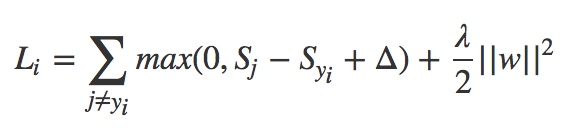

A1-2-SVM
数据预处理
1. 抓取一定量的数据
2. 将数据变为2维，即(num_train,D)
3. 减去图像的平均值，添加偏置维度
>>>
# 抓取数据
num_training = 49000
num_validation = 1000
num_test = 1000
mask = range(num_training)
X_train = X_train[mask]
y_train = y_train[mask]
mask = range(num_training, num_training + num_validation)
X_val = X_train[mask]
y_val = y_train[mask]
mask = range(num_test)
X_test = X_test[mask]
y_test = y_test[mask]
# 降维度
X_train = np.reshape(X_train, (X_train.shape[0], -1))
X_val = np.reshape(X_val, (X_val.shape[0], -1))
X_test = np.reshape(X_test, (X_test.shape[0], -1))
X_dev = np.reshape(X_dev, (X_dev.shape[0], -1))
# 预处理
mean_image = np.mean(X_train, axis=0)
X_train -= mean_image
X_val -= mean_image
X_test -= mean_image
X_train = np.hstack([X_train, np.ones((X_train.shape[0], 1))])
X_val = np.hstack([X_val, np.ones((X_val.shape[0], 1))])
X_test = np.hstack([X_test, np.ones((X_test.shape[0], 1))])
>>>

SVM分类器

1. 易于理解的loss计算法
输入：W(D,num_classes),X(num_train,D),y(num_train,1),reg(int)
输出：loss(num_train,num_classes),dW(D,num_classes)
>>>
loss = 0
dW = np.zeros(W.shape)
num_classes = W.shape[1]
num_train = X.shape[0]
# 对于每个训练样本i
for i in range(num_train):
    # scores代表训练样本i的标签score列表
    scores = X[i].dot(W)
    # correct_class_score:训练样本i正确的标签y[i]在scores上的score
    correct_class_score = scores[y[i]]
    # 遍历训练样本i的标签score列表，即scores
    # 计算loss
    # 在正确的位置，loss不加
    # 在错误的位置上，加上 max(0, scores[j] - correct_class_score + 1)
    # 计算gradient
    # 在正确的位置，dW - X.T
    # 在错误的位置，dW + X.T
    for j in range(num_classes):
        if j == y[i]:
            continue
        margin = scores[j] - correct_class_score + 1
        if margin > 0:
            loss += margin
            dW[:,y[i]] += -X[i,:].T
            dW[:,j] += X[i,:].T
# 正则化
loss /= num_train
dW /= num_train
loss += reg * np.sum(W*W)
dW += reg * W
>>>

SGD梯度下降
很简单，就是
>>>
W = W - learning_rate * grad
>>>

构建完整SVM+SGD分类器
首先，我们可以构建SVM+SGD训练器
>>>
def train(self, X, y, learning_rate=1e-3, reg=1e-5, num_iters=100,
batch_size=200, verbose=False):
    num_train, D = X.shape
    num_classes = np.max(y) + 1
    if self.W is None:
        self.W = 0.001 * np.random.randn(dim, num_classes)
    loss_history = []
    for it in range(num_iters): 
        *# 分成一个个batch送进去*
        indices = np.random.choice(num_train,batch_size)
        X_batch = X[indices]
        y_batch = y[indices]
        *# SVM*
        loss, grad = self.loss(X_batch, y_batch, reg)
        loss_history.append(loss)
        *# SGD*
        self.W -= learning_rate * grad
    return loss_history
>>>
然后，我们可以构建预测器
>>>
def predict(self, X):
    y_pred = np.zeros(X.shape[0])
    *# 选取score最高的为预测标签*
    y_pred = np.argmax(np.dot(X,self.W),axis=1)
    return y_pred
>>>

使用验证集去调整超参数
*正则化强度和学习率*
>>>
learning_rates = [1e-7,5e-7,1e-6,5e-6,1e-5,5e-5]
regularization_strengths = [2.5e4,3e4,3.5e4,4e4,4.5e4,5e4]
best_val = -1 
best_svm = None
for lr in learning_rates:
    for reg in regularization_strengths:
        *# 分类器*
        svm = LinearSVM()
        *# 训练分类器*
        loss_hist = svm.train(X_train, y_train, learning_rate=lr, reg=reg,
                      num_iters=500, verbose=True)
        *# 预测val*
        y_val_pred = svm.predict(X_val)
        val_accuracy = np.mean(y_val_pred == y_val)
        *# 检测效果*
        if(best_val<val_accuracy):
        best_val = val_accuracy
        best_svm = svm
>>>

