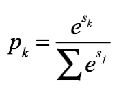
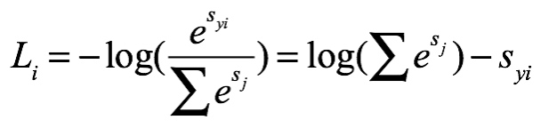
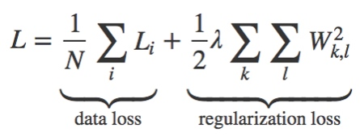
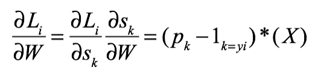
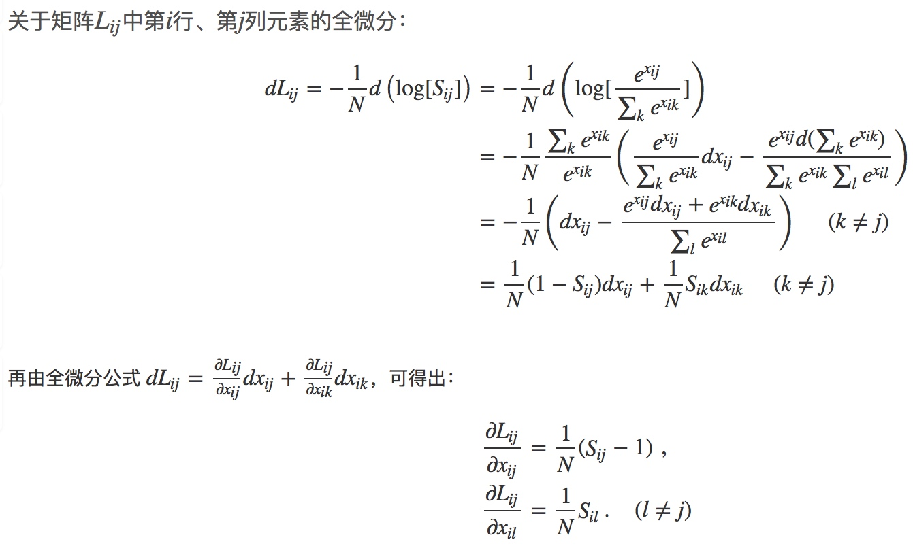

A1-3-Softmax
Cross-entropy loss

Loss:

Gradient:

Softmax:
输入：W(D,num_classes),X(num_train,D),y(num_train,1),reg(int)
输出：loss(num_train,num_classes),dW(D,num_classes)
>>>
loss = 0.0
dW = np.zeros_like(W)
num_classes = W.shape[1]
num_train = X.shape[0]
# 对于每个训练样本i
for i in range(num_train):
    *# 计算scores，然后预处理*
    scores = X[i].dot(W)
    scores -= np.max(scores)
    *# 抽出训练样本i正确标签对应的score --> syi*
    correct_class_score = scores[y[i]]
    *# log(sum(e^sj))*
    exp_sum = np.sum(np.exp(scores))
    *# 求和*
    loss += np.log(exp_sum) - correct_class_score
    *# 计算梯度
    # when j!= y_i:
    # dW += pk * X[i]
    # when j== y_i:
    # dW += (pk - 1) * X[i]*
    dW[:,y[i]] -= X[i]
    for j in range(num_classes):
        dW[:,j] += (np.exp(scores[j]) / exp_sum) * X[i]
    *# 正则化*
    loss = loss / num_train + 0.5 * reg * np.sum(W * W)
    dW = dW / num_train + reg * W
return loss, dW
>>>

