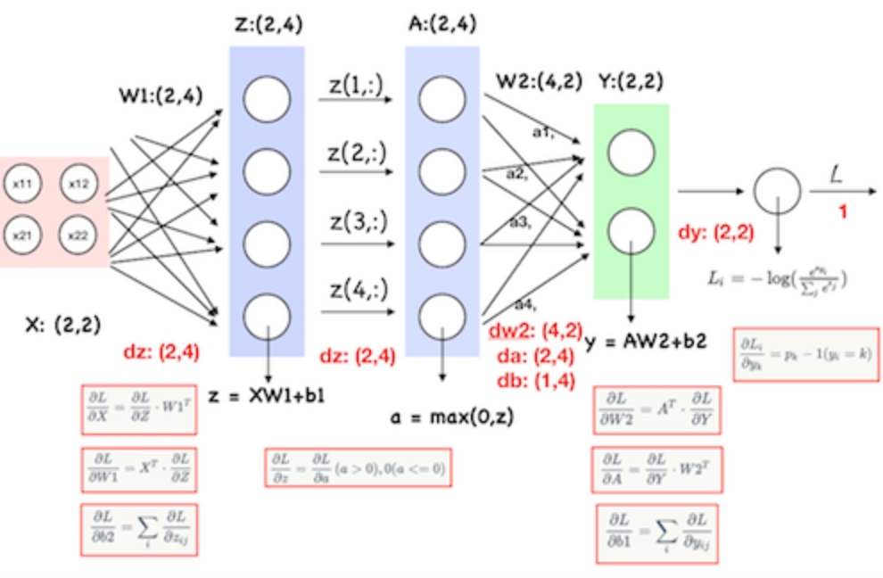

A1-4-FCN

全连接神经网络
Fully-connected Neural Network
整个神经网络相当于一个函数，这个函数本质上就是一连串的矩阵运算再加上激活函数的非线性变换

Initialization:
>>>
self.params['W1'] = std * np.random.randn(input_size, hidden_size)
self.params['b1'] = np.zeros(hidden_size)
self.params['W2'] = std * np.random.randn(hidden_size, output_size)
self.params['b2'] = np.zeros(output_size)
>>>

Forward:
>>>
W1, b1 = self.params['W1'], self.params['b1']
W2, b2 = self.params['W2'], self.params['b2']
num_train = X.shape[0]
# 前进！
Z = np.dot(X,W1)+b1
A = np.maximum(0, hidden_layer1)
Y = np.dot(hidden_layer,W2) + b2
# 用向量法计算Softmax的loss
Y -= Y.max(axis=1).reshape(-1,1)
sum_exp_Y = np.sum(np.exp(Y),axis=1)
correct_class_Y = Y[range(num_train),y]
loss = np.sum(np.log(sum_exp_Y)) - np.sum(correct_class_Y)
loss = loss/num_train + 0.5 * reg * (np.sum(W1 * W1) + np.sum(W2 * W2))
>>>

Backpropagate:
>>>
# d(Loss/Y) = pk - 1(k=yi)
divided_exp_Y = np.exp(Y) / sum_exp_Y.reshape(-1,1)
divided_exp_Y[range(num_train),y] -= 1
dY = divided_exp_Y
dY /= num_train
# d(Loss/W2) = d(Loss/Y) * d(Y/W2) = A.T * dY
grads_W2 = np.dot(A.T,dY)
# d(Loss/b2) = sum(dY)
grads_b2 = np.sum(dY,axis=0)
# d(Loss/A) = d(Loss/Y) * d(Y/Z) = dY * W2.T
dA = np.dot(dY,W2.T)
# d(Loss/Z) = dA (a>0) 0 (a<0)
dA [A<=0] = 0
dZ = dA
# d(Loss/W1) = d(Loss/Z) * d(Z/W1)
grads_W1 = np.dot(X.T,dZ)
# d(Loss/b1) = d(Loss/Z) * d(Z/b1)
grads_b1 = np.dot(dZ,axis=0)
>>>

训练整个全连接神经网络
>>>
def train(self, X, y, X_val, y_val,
            learning_rate=1e-3, learning_rate_decay=0.95,
            reg=5e-6, num_iters=100,
            batch_size=200, verbose=False):
    num_train = X.shape[0]
    iterations_per_epoch = max(num_train / batch_size, 1)
    *# 分batch训练*
    for it in range(num_iters):
        indices = np.random.choice(num_train, batch_size, replace=True)
        X_batch = X[indices]
        y_batch = y[indices]
        *# 前向和后向*
        loss, grads = self.loss(X_batch, y=y_batch, reg=reg)
        *# 梯度下降*
        self.params['W1'] -= learning_rate * grads['W1']
        self.params['b1'] -= learning_rate * grads['b1']
        self.params['W2'] -= learning_rate * grads['W2']
        self.params['b2'] -= learning_rate * grads['b2']
>>>

预测
def predict(self, X):
    *# 提取参数*
    W1 = self.params['W1']
    b1 = self.params['b1']
    W2 = self.params['W2']
    b2 = self.params['b2']
    *# 前向*
    Z = np.dot(X,W1)+b1
    A = np.maximum(0, hidden_layer1)
    Y = np.dot(hidden_layer,W2) + b2
    *# 预测*
    y_pred = np.argmax(Y,axis=1)

