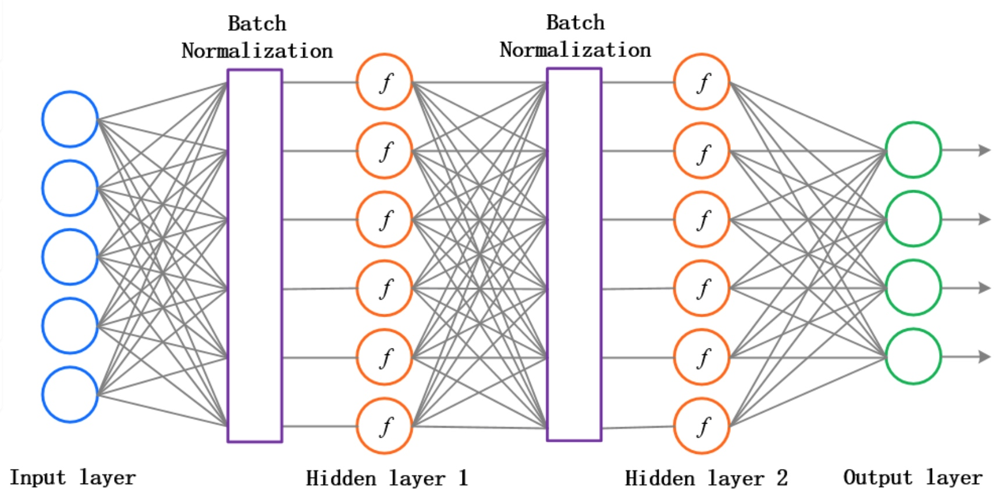
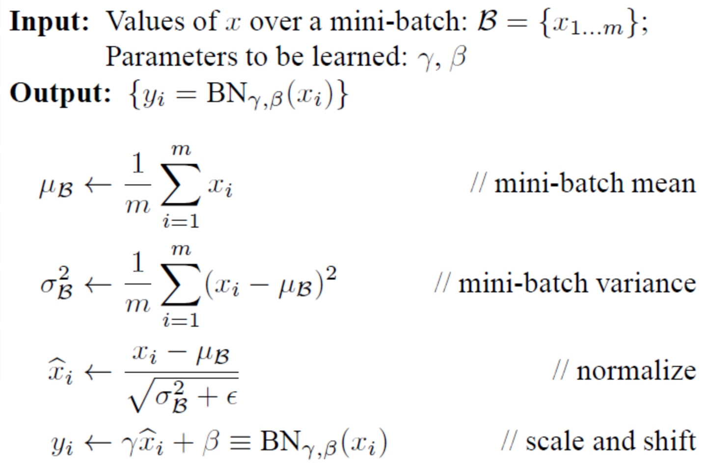
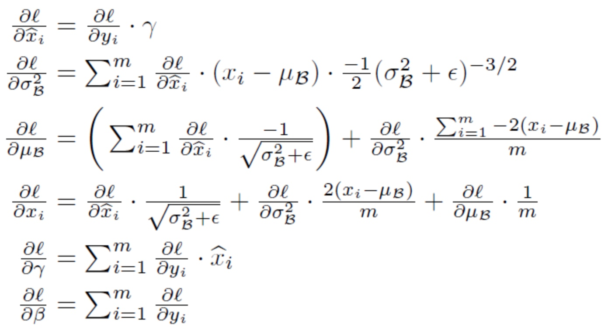

A2-1-Batch_Normalization
批量归一化
我们在每一层神经网络的激活函数前都进行批量归一化处理
它可以进一步加速收敛，并且过拟合现象可以得到一定的缓解

它的数学公式如下：

我们算出sample_mean和sample_var，使得每一维特征服从标准高斯分布，即均值为0，标准差为1
最后，用变换重构，引入可学习参数γ和β，让该层神经元可以恢复
我们还用到了滑动平均法：
在train模式里，running_mean, running_var 会在每经过一个BN层进行一次迭代计算
并在离开每一个BN层之前保存替换掉原BN参数字典中的 running_mean, running_var
在训练结束后，这两个参数将会用于 test 测试模式下的每一个BN层中
>
输入：X(num_train,D), gamma(D,), beta(D,), eps(int), momentum(int)
输出：out(num_train,D), cache
>>>
num_train = X.shape[0]
D = X.shape[1]
if mode == 'train':
    sample_mean = np.mean(x, axis=0)
    sample_var = np.var(x, axis=0)
    x_hat = (x - sample_mean) / (np.sqrt(sample_var + eps)
    out = gamma * x_hat + beta
    cache = (x, sample_mean, sample_var, x_hat, eps, gamma, beta)
    running_mean = momentum * running_mean + (1 - momentum) * sample_mean
    running_var = momentum * running_var + (1 - momentum) * sample_var
if mode == 'test':
    out = (x - running_mean) * gamma / (np.sqrt(running_var + eps)) + beta
>>>

反向有点复杂：

>
输入：dout(N,D), cache
输出：dx, dgamma, dbeta 
>>>
x, mean, var, x_hat, eps, gamma, beta = cache
N = x.shape[0]
    dgamma = np.sum(dout * x_hat, axis=0)   *# 第5行公式*
    dbeta = np.sum(dout * 1.0, axis=0)      *# 第6行公式*
    dx_hat = dout * gamma                   *# 第1行公式*
    dx_hat_numerator = dx_hat / np.sqrt(var + eps)      *# 第3行第1项(未负求和)*
    dx_hat_denominator = np.sum(dx_hat * (x - mean), axis=0)    *# 第2行前半部分*
    dx_1 = dx_hat_numerator                 *# 第4行第1项*
    dvar = -0.5 * ((var + eps) ** (-1.5)) * dx_hat_denominator  *# 第2行公式*
    dmean = -1.0 * np.sum(dx_hat_numerator, axis=0) + \
              dvar * np.mean(-2.0 * (x - mean), axis=0)  *# 第3行公式(部分)*
    dx_var = dvar * 2.0 / N * (x - mean)    *# 第4行第2项*
    dx_mean = dmean * 1.0 / N               *# 第4行第3项*
    # with shape (D,), no trouble with broadcast
    dx = dx_1 + dx_var + dx_mean            *# 第4行公式*
    return dx, dgamma, dbeta
>>>

