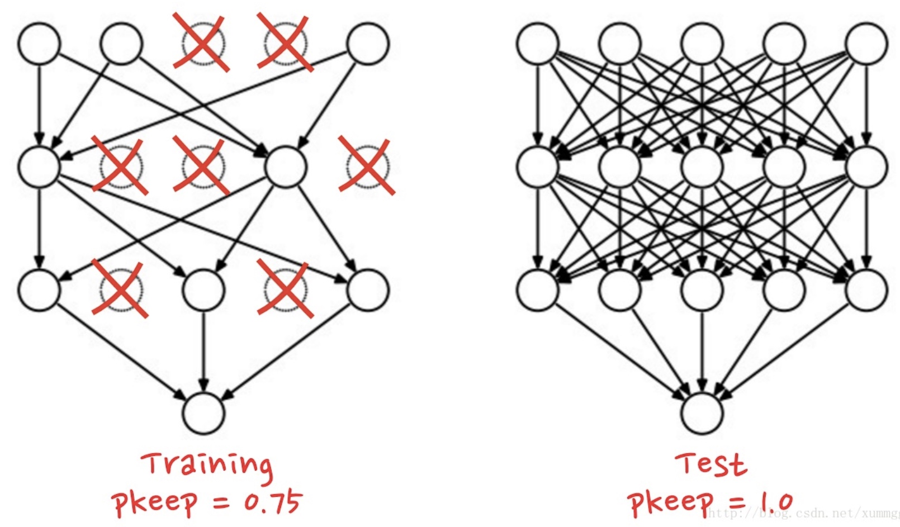

A2-2-Dropout
随机失活
有效防止过拟合：
随机的一些神经元不工作，避免某些特征只在固定组合下才生效，可以有意识地让神经网络去学习一些普遍的共性

前向传播：
>
输入：X(any shape), dropout_param
输出：out, cache
>>>
p = dropout_param['p']
mode = dropout_param['mode']
# 在'test'模式下不做动作
if mode == 'train':
    height = X.shape[0]
    width = X.shape[1]
    *# np.random.rand(X.shape): 创建一个和X大小相等的矩阵，然后填充0-1间的随机数*
    *# np.random.rand(height, width) < (1-p): 让小于(1-p)的为真，大于的为假*
    mask = np.random.rand(height, width) < (1-p)
    out = X * mask
if mode == 'test':
    out = X
>>>

反向传播：
>
输入：dout, cache
输出：dx
>>>
dropout_param, mask = cache
mode = dropout_param['mode']
if mode == 'train':
    dx = dout * mask
if mode == 'test':
    dx = dout
>>>

