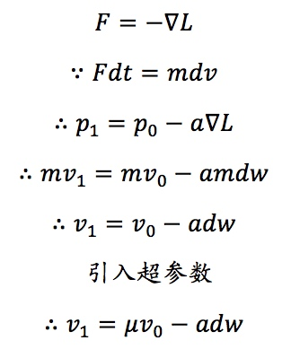

A2-3-SGD_with_momentum

传统的梯度下降本质上是将损失函数的梯度向量投影在模型参数空间，然后指导每个模型参数如何更新，每次更新的幅度由learnning_rate来控制；而动量版本的梯度下降方法可以看作是将初速度为0的小球从在一个山体表面上放手，不同的损失值代表山体表面的海拔高度，那么模型参数的更新不再去参考小球所在处的山体倾斜情况，而是改用小球的速度矢量在模型参数空间的投影来修正更新参数。

>
输入：w, dw, config
输出：next_w, config
>>>
learning_rate = 1e-2
momentum = 0.9
v = config.get('velocity', np.zeros_like(w))
v = momentum * v - learning_rate * w
next_w = w + v
config['velocity'] = v
>>>

