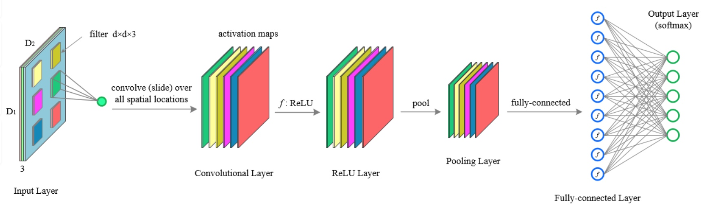
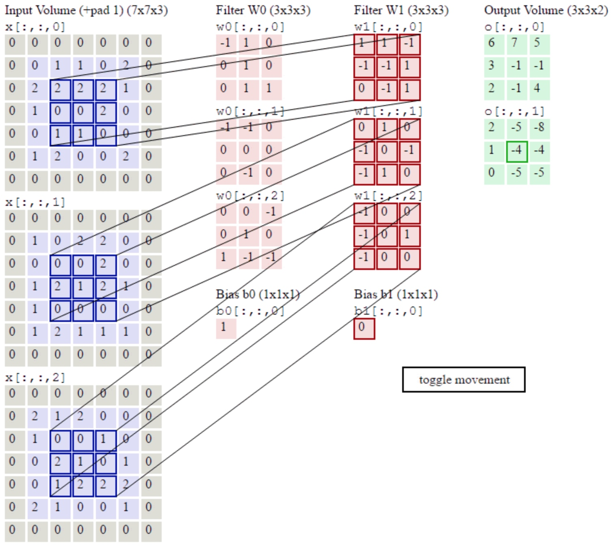
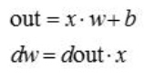
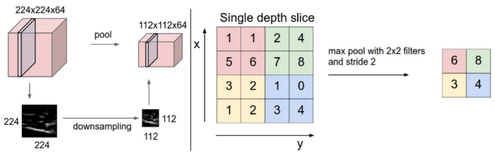

A2-4-CNN

传统的卷积神经网络结构

卷积层

卷积层的理解：

1. 实现某像素点与周围信息的整合
   我们将一个像素与它周围‘卷积’，就是将一个像素与其周围的点建立联系
2. 实现某像素点信息的多种挖掘
   我们用多个滤波器对同一个输入进行卷积，在每一个深度上，我们都能对于同一个像素点挖掘出不同的信息
   

   
前向卷积：
>
输入：
x:(N,C,H,W)-->(num_train, Channels, Height, Width)
可以理解为 N 张颜色通道为 C 高为 H 像素宽为 W 像素的图片
w:(F,C,HH,WW)-->(num_filters, Channels, Height, Width)
可以理解为 F 个深度为 C 高为 HH 个神经元宽为 WW 个神经元的滤波器
b:(F,) 
偏置
conv_param:(stride, pad)
参数
输出：
out:(N, F, new_H, new_W)-->(num_train, num_filters, Height, Width)
可以理解为 N 张图片中每张图片由 F 个滤波器卷积出来的 F 个新层,每个层高 new_H,高 new_W
其中,
new_H = 1 + (H + 2 * pad - HH) / stride
new_W = 1 + (W + 2 * pad - WW) / stride
>>>
# 参数设置
N, C, H, W = x.shape
F, C, HH, WW = w.shape
stride = conv_param['stride']
pad = conv_param['pad']
new_H = 1 + int((H + 2 * pad - HH) / stride)
new_W = 1 + int((W + 2 * pad - WW) / stride)
out = np.zeros([N, F, new_H, new_W])
# 卷积开始
x_padded = np.pad(x, ((0,0), (0,0), (pad,pad), (pad,pad)), 'constant')
for n in range(N):
    for f in range(F):
        for i in range(new_H):
            for j in range(new_W):
                out[n,f,i,j] = (**) * w[f] + b[f]
# 所有颜色通道是卷积在一起的                
**:np.sum(x_padded[n, :, i * stride:i * stride+HH, j * stride:j * stride+WW]
cache = (x,w,b,conv_param)
>>>

反向卷积

这里的x是前向卷积中的一扇扇‘窗户’
我们用g()代表卷积层后所有的操作
所以，反向卷积如下，
>
输入：dout-->d(g/out)
输出：dx-->d(g/x), dw-->d(g/w), db-->d(g/b)
>>>
# 参数设置
x, w, b, conv_param = cache
pad = conv_param['pad']
stride = conv_param['stride']
N, C, H, W = x.shape
F, C, HH, WW = w.shape
N, F, new_H, new_W = dout.shape
dx = np.zeros_like(x)
dw = np.zeros_like(w)
db = np.zeros_like(b)
x_padded = np.pad(x, ((0,0), (0,0), (pad,pad), (pad,pad)), 'constant')
dx_padded = np.pad(dx, ((0,0), (0,0), (pad,pad), (pad,pad)), 'constant')
# 卷积开始
for n in range(N):
    for f in range(F):
        for i in range(new_H):
            for j in range(new_W):
window = x_padded[n, :, i*stride:i*stride+HH, j*stride:j*stride+WW]
# db = d(g/b) = d(g/out)*d(out/b) = dout
db[f] += dout[n,f,i,j]
# dw = d(g/w) = d(g/out)*d(out/w) = dout * window
dw[f] += window * dout[n,f,i,j]
# dx = d(g/x) = d(g/out)*d(out/x) = dout * w
dx_padded[n,:,i*stride:i*stride+HH, j*stride:j*stride+WW] += w[f] * dout[n,f,i,j]
>>>

 
池化层

池化层的理解：

卷积层负责像素间建立联系，池化层负责降维

正向池化
>
输入：x(N,C,H,W)-->x(num_train, channels, height, width)
输出：out(N,C,new_H,new_W)
new_H = 1 + (H - pool_height) / pool_stride
new_W = 1 + (W - pool_width) / pool_stride
>>>
# 参数设置
N, C, H, W = x.shape
pool_height = pool_param['pool_height']
pool_width  = pool_param['pool_width']
pool_stride = pool_param['stride']
new_H = 1 + int((H - pool_height) / pool_stride)
new_W = 1 + int((W - pool_width) / pool_stride)
out = np.zeros([N, C, new_H, new_W])
# 池化开始
for n in range(N):
    for c in range(C):
        for i in range(new_H):
            for j in range(new_W):
out[n,c,i,j] = np.max(x[n, c, i*pstride:i*pstride+ph, j*pstride:j*pstride+hw])
>>>

反向池化
>>>
for n in range(N):
    for c in range(C):
        for i in range(new_H):
            for j in range(new_W):
window = x[n, c, i*pstride:i*pstride+ph, j*pstride:j*pstride+hw]
# 在那个范围内，除了选出的max导数为dout，其它的都为0
dx[n, c, i*pstride:i*pstride+ph, j*pstride:j*pstride+hw] 
      += (window == np.max(window))*dout[n,c,i,j]
>>>

Spatial_Batch_Normalization

为了防止训练过程中的“梯度弥散”

在卷积神经网络中的Batch_Normalization与全连接神经网络中的不太一样
但是，它可以转换成全连接神经网络中的形式，
用之前的Batch_Normalization来实现

前向：
>>>
N, C, H, W = x.shape
x_new = x.transpose(0, 2, 3, 1).reshape(N * H * W, C)
out, cache = batchnorm_forward(x_new, gamma, beta, bn_param)
out = out.reshape(N, H, W, C).transpose(0, 3, 1, 2)
>>>

后向：
>>>
N, C, H, W = dout.shape
dout_new = dout.transpose(0, 2, 3, 1).reshape(N*H*W, C)
dx, dgamma, dbeta = batchnorm_backward(dout_new, cache)
dx = dx.reshape(N, H, W, C).transpose(0, 3, 1, 2)
>>>

