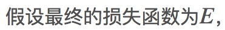

A3-1-RNN
Recurrent Neural Networks
递归神经网络
递归神经网络是一类处理序列数据的神经网络

单步前向传播

>
输入：
x - 外部输入数据 - (N,D)
prev_h - 上一个时刻隐藏状态 - (N,H)
Wx - x对应的权值矩阵 - (D,H)
Wh - h对应的权值矩阵 - (H,H)
b - 偏差 - (H,)
输出：
next_h - 下一个时刻隐藏状态 - (N,H)
cache
>>>
next_h = np.tanh(np.dot(x,Wx) + np.dot(prev_h,Wh) + b)
cache = (x, prev_h, Wx, Wh, next_h)
>>>

单步反向传播

>
输入：dnext_h, cache
输出：dx,dprev_h,dWx,dWh,db
>>>
x, prev_h, Wx, Wh, next_h = cache
# dtanh_a = d(E/tanh_a) = d(E/next_h) * d(next_h/tanh_a)
# notice:d(next_h/tanh_a) = (1 - tanh_a ** 2) = (1 - next_h ** 2)
dtanh_a = dnext_h * (1 - next_h **2)
# dx = d(E/x) = d(E/tanh_a) * d(tanh_a/x) = dtanh_a * Wx.T
dx = np.dot(dtanh_a, Wx.T)
# dprev_h = d(E/prev_a) = d(E/tanh_a) * d(tanh_a/prev_h) = dtanh_a * Wh.T
dprev_h = np.dot(dtanh_a, Wh.T)
dWx = np.dot(x.T, dtanh_a)
dWh = np.dot(prev_h.T, dtanh_a)
db = dtanh_a.sum(axis=0)
>>>

RNN前向传播
就是单步前向传播的循环
>
输入：
x - 整个序列的输入数据 - (N,T,D)
h0 - 初始隐藏层 - (N,H)
Wx - 权值矩阵Wx - (D,H)
Wh - 权值矩阵Wh - (H,H)
b - 偏差
输出：
h - 整个序列的隐藏状态 - (N,T,H)
cache
>>>
N,T,D=x.shape
N,H=h0.shape
# 之前公式中的a，图中的fw
tanh_a=np.empty([N,T,H])
# 隐藏状态h
h_cache=np.empty([N,T,H])
# 滞后h一个时间点
prev_h_cache=np.empty([N,T,H])
prev_h=h0
# 前向开始
for i in range(0,T):
    prev_h_cache[:,i,:] = prev_h
    *# 单向前向传播*
    next_h, cache_temp = rnn_step_forward(x[:,i,:], prev_h, Wx, Wh, b)
    h_cache = next_h
    prev_h = next_h
    tanh_a = cache_temp[4]
cache = (x, prev_h, Wx, Wh, tanh_a)
>>>

RNN反向传播
反向传播就是单步反向传播的循环
因为每一层神经网络都共享了参数Wxh，Whh，b，最终的dEdWxh是每一层计算得到的dEdWxh的和。
另外两个参数也一样。
>
输入：dh(N,T,H), cache
输出：dx(N,T,D), dh0(N,H), dWx(D,H), dWh(H,H), db(H,)
>>>
# 设置参数
x=cache[0]
N,T,D=x.shape
N,T,H=dh.shape
dWx=np.zeros((D,H))
dWh=np.zeros((H,H))
db=np.zeros(H)
dout=dh
dx=np.empty([N,T,D])
dh=np.empty([N,T,H])
hnow=np.zeros([N,H])
# 反向开始
for k in range(0, T):
    i = T-1-k
    *# 提取上层传来的梯度*
    hnow=hnow+dout[:,i,:]
    cacheT=(cache[0][:,i,:],cache[1][:,i,:],cache[2],cache[3],cache[4][:,i,:])
    *# 单步反向传播*
    dx_temp, dprev_h, dWx_temp, dWh_temp, db_temp 
             = rnn_step_backward(hnow, cacheT)
    hnow=dprev_h
    dx[:,i,:]=dx_temp
    *# 将每一层共享的参数对应的梯度相加*
    dWx=dWx+dWx_temp
    dWh=dWh+dWh_temp
    db=db+db_temp
dh0=hnow
>>>

