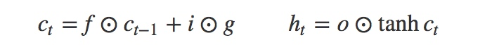

A3-2-LSTM
Long-Short Term Memory
长短时记忆单元

单步前向传播

符号：
sigmoid -- tanh -- 逐项相乘
>
输入：x(N,D), prev_h(N,H), prev_c(N,H), Wx(D,4H), Wh(H,4H), b(4H,)
输出：next_h(N,H), next_c(N,H), cache
>>>
N,H = prev_h.shape
# 计算A
A= x.dot(Wx)+prev_h.dot(Wh)+b
# 计算ai,af,ao,ag
ai = A[:,0:H]
af = A[:,H:2*H]
ao = A[:,2*H:3*H]
ag = A[:,3*H:4*H]
# 计算i,f,o,g
i = sigmoid(ai)
f = sigmoid(af)
o = sigmoid(ao)
g = np.tanh(ag)
# 计算ct,ht
next_c=np.multiply(f,prev_c)+np.multiply(i,g)
next_h=np.multiply(o,np.tanh(next_c))
cache=(x,prev_h,prev_c,i,f,o,g,Wx,Wh,next_c,A)
>>>

单步反向传播

>
输入：dnext_h(N,H), dnext_c(N,H), cache
输出：dx(N,D), dprev_h(N,H), dprev_c(N,H), dWx(D,4H), dWh(H,4H), db(4H,)
>>>
#提取cache中的变量
N,H=dnext_h.shape
f=cache[4]
o=cache[5]
i=cache[3]
g=cache[6]
nc=cache[9]
prev_c=cache[2]
prev_x=cache[0]
prev_h=cache[1]
A=cache[10]
ai=A[:,0:H]
af=A[:,H:2*H]
ao=A[:,2*H:3*H]
ag=A[:,3*H:4*H]
Wx=cache[7]
Wh=cache[8]
#计算到dprev_c
dc_c=np.multiply(dnext_c,f)
dc_h_temp=np.multiply(dnext_h,o)
temp = np.ones_like(nc)-np.square(np.tanh(nc))
temp2=np.multiply(temp,f)
dprev_c=np.multiply(temp2,dc_h_temp)+dc_c
# 计算dc
dc_from_h=np.multiply(dc_h_temp,temp)
dtotal_c=dc_from_h+dnext_c
#计算到o,f,i,g的梯度
tempo=np.multiply(np.tanh(nc),dnext_h)
tempf=np.multiply(dtotal_c,prev_c)
tempi=np.multiply(dtotal_c,g)
tempg=np.multiply(dtotal_c,i)
#计算到ao,ai,af,ag的梯度
tempao=np.multiply(tempo,np.multiply(o,np.ones_like(o)-o))
tempai=np.multiply(tempi,np.multiply(i,np.ones_like(o)-i))
tempaf=np.multiply(tempf,np.multiply(f,np.ones_like(o)-f))
dtanhg = np.ones_like(ag)-np.square(np.tanh(ag))
tempag=np.multiply(tempg,dtanhg)
#计算各参数的梯度
TEMP=np.concatenate((tempai,tempaf,tempao,tempag),axis=1)
dx=TEMP.dot(Wx.T)
dprev_h=TEMP.dot(Wh.T)
xt=prev_x.T
dWx=xt.dot(TEMP)
ht=prev_h.T
dWh=ht.dot(TEMP)
db=np.sum(TEMP,axis=0).T
>>>

LSTM正向传播
>>>
def lstm_forward(x, h0, Wx, Wh, b):
    N,T,D=x.shape
    N,H=h0.shape
    prev_h=h0
    *# 以下的变量为反向传播时所需*
    h3=np.empty([N,T,H])
    h4=np.empty([N,T,H])
    I=np.empty([N,T,H])
    F=np.empty([N,T,H])
    O=np.empty([N,T,H])
    G=np.empty([N,T,H])
    NC=np.empty([N,T,H])
    AT=np.empty([N,T,4*H])
    h2=np.empty([N,T,H])
    prev_c=np.zeros_like(prev_h)
    for i in range(0, T):
        h3[:,i,:]=prev_h
        h4[:,i,:]=prev_c
        *# 单步前向传播*
        next_h, next_c, cache_temp 
                 = lstm_step_forward(x[:,i,:], prev_h, prev_c, Wx, Wh, b)
        prev_h=next_h
        prev_c=next_c
        h2[:,i,:]=prev_h
        I[:,i,:]=cache_temp[3]
        F[:,i,:]=cache_temp[4]
        O[:,i,:]=cache_temp[5]
        G[:,i,:]=cache_temp[6]
        NC[:,i,:]=cache_temp[9]
        AT[:,i,:]=cache_temp[10]
        cache=(x,h3,h4,I,F,O,G,Wx,Wh,NC,AT)    
    return h2, cache
>>>

LSTM反向传播
>>>
def lstm_backward(dh, cache):
        x=cache[0]
    N,T,D=x.shape
    N,T,H=dh.shape
    dWx=np.zeros((D,4 * H))
    dWh=np.zeros((H,4 * H))
    db=np.zeros(4 * H)
    dout=dh
    dx=np.empty([N,T,D])
    hnow=np.zeros([N,H])
    cnow=np.zeros([N,H])
    for k in range(0, T):
        i=T-1-k
        hnow=hnow+dout[:,i,:]
        cacheT=(cache[0][:,i,:],cache[1][:,i,:],cache[2][:,i,:],cache[3][:,i,:],cache[4][:,i,:],cache[5][:,i,:],cache[6][:,i,:],cache[7],cache[8],cache[9][:,i,:],cache[10][:,i,:])
        *# 单步反向传播*
        dx_temp, dprev_h, dprev_c, dWx_temp, dWh_temp, db_temp = lstm_step_backward(hnow, cnow, cacheT)
        hnow=dprev_h
        cnow=dprev_c
        dx[:,i,:]=dx_temp
        dWx=dWx+dWx_temp
        dWh=dWh+dWh_temp
        db=db+db_temp
    dh0=hnow
    return dx, dh0, dWx, dWh, db
>>>

